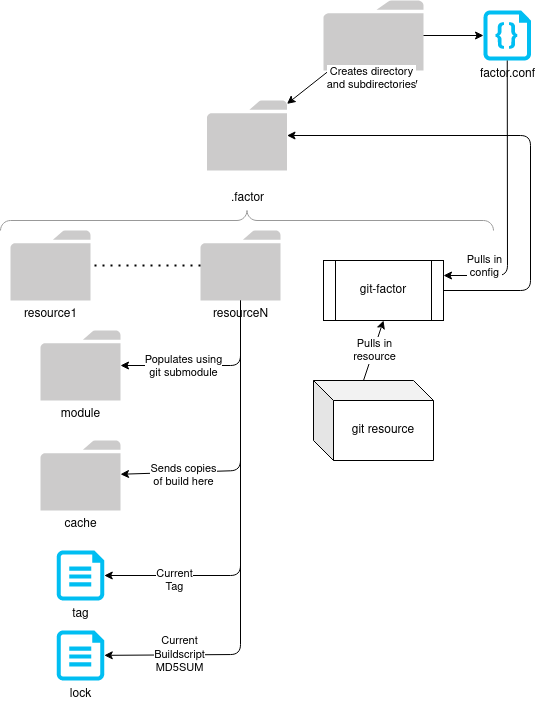

# FACTOR
---
Factor is a build assistant tool designed to make organizing submodules and their construction much easier. It is installed as a GIT plugin.

Here's a simple layout diagram:  



Factor only requires a few things:
1. A `factor.conf` file in the target repository.
2. Commands: rsync, git

When running the `git factor` command, you must be in the target directory containing this file or set the `FACTOR_FILE` environment variable to the path of the `factor.conf` file.

---

## The `factor.conf` file
The conf file is structured as:
```
[resource]
  url=
  tag=
  requires=req1 ... reqN
  env=env1 ... envN
  prefix=
  script=
```
Here are the rules to the CONF file:
1. `url` should specify the location to the target GIT repository. It is required.
2. `tag` must be a valid tag in that repository. The default is `master`
3. `requires` is a space-separated list of other resource names. They will be built first.
4. `env` is a space-separated list of section names in the `factor.conf`. Add entries to those sections; this will automatically export shell variables for your build scripts (no need to put 'export')
5. `prefix` is the final destination of your resource's build. It will given as the variable `PREFIX` in your build script. This value changes if `isolate` is defined. You may also use the `%git%` variable to specify the path your GIT project root.
6. `script` is the location of the buildscript to execute in the module's directory. The scipt must be set as execuatble. You may use the `%git%` syntax to specifiy the location.

You may also define enviroment variables in sections in the `factor.conf`. Here's what that can look like:
```
[environment_name]
PATH=/bin:/usr/bin
CUSTOM_VAR=foo
CC=/usr/bin/gcc
```

Note that you do not need to put the `export` keyword. This is done automatically.

## Command Usage:
git factor OPERATION TARGET1 ... TARGETn  

OPERATIONS:
  - sync:
      Firstly ensures that the '.factor' directory exists. Then, ensures the
      basic directory structure for the module is present. Git submodule is 
      then used to add/update the module.
      
  - build:
      Run 'sync' on the module. Then, check if the build needs to continue;
      if the tag or buildscript change, or if the 'cache' directory for the
      module is missing, then proceed, otherwise, exit 11. Attempt to build
      each prerequiste. If successful, create cache directory and clean the
      git module directory. If isolation is not set, set the environment
      variables and run the buildscript. Otherwise, create a bind-mount for
      the root and module directories in the cache, chroot into the cache,
      and execute the buildscript. Absolute paths defined in the PATH and
      LD_LIBRARY_PATH are converted for the chroot environment. Finally, 
      copy the contents of the cache into the 'prefix' directory.
    
  - clean:
      Remove the modules '.factor' directory
   
  - prune:
      Remove the submodule. Then, run 'clean' on it. Then remove the entry
      from the 'factor.conf' file.

## Installation
Simply run `make install` to install the binary. To set a custom path, do `make PREFIX='<path>' install`

---

## Build Variables
The following variables are injected to every buildscript's environment:

PREFIX_CACHE - Path to the `<gitfolder>/.factor/<module>/cache` directory.
PREFIX_BUILD - Path defined by the `prefix` variable in the factor.conf

---

## Configuration
You may set the following varibles using the `git config` command:

factor.safevars true|false - This sets the shell quotes used on the environment
                             variables pulled in when running a build script.
                             The default is *false*, which uses single quotes.
                             Setting to *true* will instead use double quotes.
                             This is important because you may wish to prevent
                             arbitrary execution/interpretation from the
                             variables set within the factor.conf. Using double
                             quotes will allow any values set to be immediately
                             interpreted upon addition to the buildscript
                             environment.

---

### A note on `isolate`
`isolate` is an experimental command used for special circumstances where a
build may require absolute/system-root paths to install correctly. Here is the usage:

```
isolate delta_dir [OPTIONS] CMD ARG1 ... ARGN

OPTIONS:
  -b|--bind <abs_dir>   Using an absolute path, bind this directory to the
                        new pseudo-root. NOTE: You cannot specify the delta
                        directory, not any of its parent folders
                        
  -l|--lower <abs_dir>  Using an absolute path, add a directory to the lowers
                        that are mounted during the overlay. NOTE: You cannot 
                        specify the delta directory, not any of its parent 
                        folders

  - delta_dir: The directory to deposite any changes made while in isolation
  - CMD ARGS: The command and arguments to be executed in the environment
  
EXAMPLES:
  ./isolate test -b /bin -b /usr/bin -b /lib -b /usr/lib echo hello
```

The script must be run as root. USE AT YOUR OWN RISK.
If you'd like a potentially safe way to test this, run it
in a Docker container.