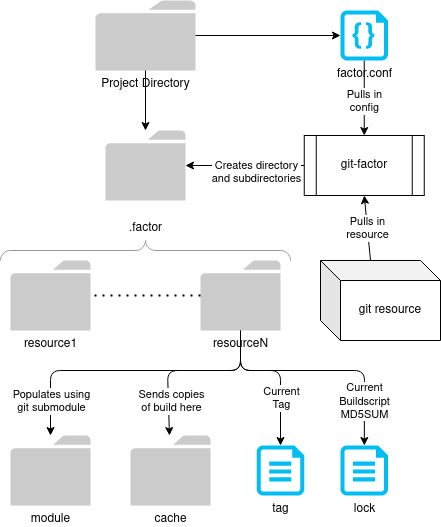

# FACTOR
---
Factor is a build assistant tool designed to make organizing submodules and their construction much easier.

Here's a simple layout diagram:  



Factor only requires one thing:
1. The place that you wish to setup your .factor folder must containe a `factor.conf` file.

When running the `factor` command, you must be in the target directory containing this file or set the `FACTOR_FILE` environment variable to the path of the `factor.yaml` file.

---

## The `factor.conf` file
The conf file is structured as:
```
[resource]
  url=
  tag=
  requires='require1 ... requireN'
  env='envfile1 ... envfileN'
  prefix=
  isolate=
  tools='tooldir1 ... tooldir2'
```
Here are the rules to the CONF file:
1. `url` should specify the location to the target GIT repository. It is required.
2. `tag` must be a valid tag in that repository. The default is `master`
3. `requires` is a space-separated list of other resource names. They will be built first.
4. `env` is a space-separated list of filenames under "%gitdir%/.factor/.env". Add files to that directory that export shell variables for your build scripts
5. `prefix` is the final destination of your resource's build. It will given as the variable `PREFIX` in your build script. This value changes if `isolate` is defined. You may also use the `%git%` variable to specify the path your GIT project root.
6. `isolate` is a special field used to run your build script in a overlay-chroot combination. Packages like Apache2 can take advantage of this option since it embeds its prefix into its configurations and files. This option requires the build to be run as root. Resulting files will be chowned back to the user/group of the repository folder. The `PREFIX` variable is also modified to the value of `isolate` (the path defined for `isolate` should be the desired 'root' prefix e.x. `isolate=/usr` to get the `PREFIX` '/usr').
7. `tools` is an important part of `isolate`, since the chroot environment created will not necessarily have all the tools you might need. Each directory listed in the variable will be a part of the overlay mount. It is highly recommended that you have a resource dedicated to 'busybox' and/or 'gcc', and have them added as dependencies, so that you can have them built and prepared for the overlay. **NOTE**: You cannot specify '/' (or any parent directory to '%gitroot%/.factor') as a tool directory; the overlay will fail.

## Command Usage:
factor OPERATION TARGET1 ... TARGETn  

OPERATIONS:
  - sync:
    - Refresh .gitmodules file
    - Git sync TARGET
    - subtree TARGET
  - build:
    - factor sync TARGET
    - Exit 11 if locked
    - Set up chroot environment if requested
    - Pull in environment variables
    - Run TARGET build script
  - compose:
    - factor build TARGET
    - Copy TARGET buildcache to build directory
  - clean:
    - clear build cache for TARGET
    - clean subtree for TARGET
  - prune:
    - Remove TARGET directory
    - Remove TARGET locks
    - Remove TARGET refs in factor.conf
    
## Installation
Simply run `make install` to install the binary. To set a custom path, do `make PREFIX='<path>' install`

If you are unable to run `git subtree`, try running `# make subtree-fix`. Ubuntu weirdly disabled this feature.